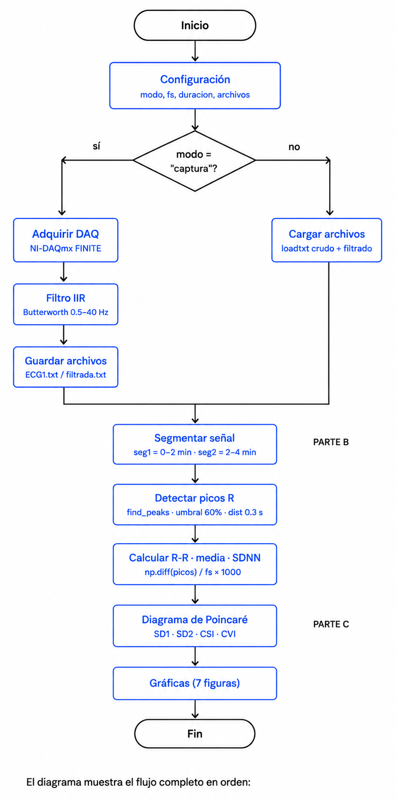
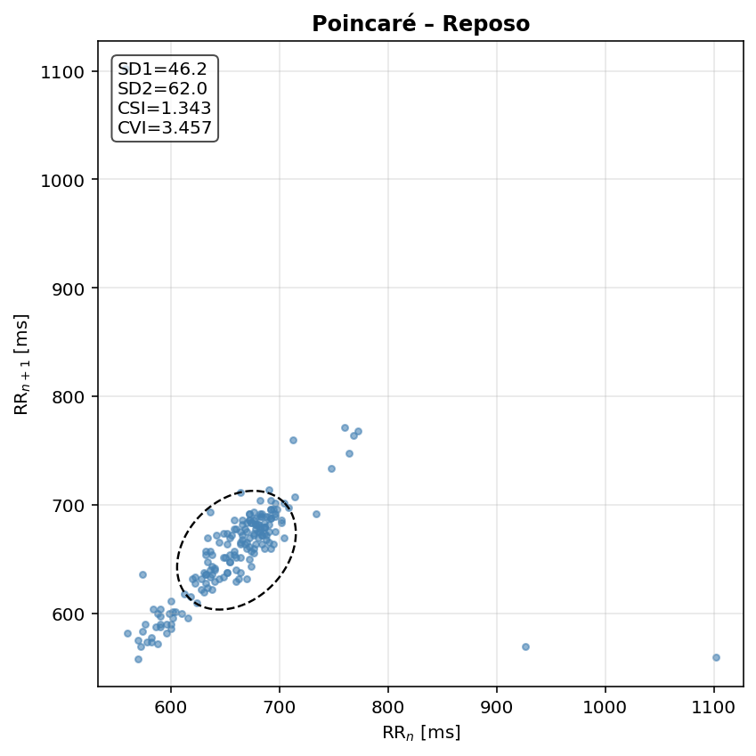
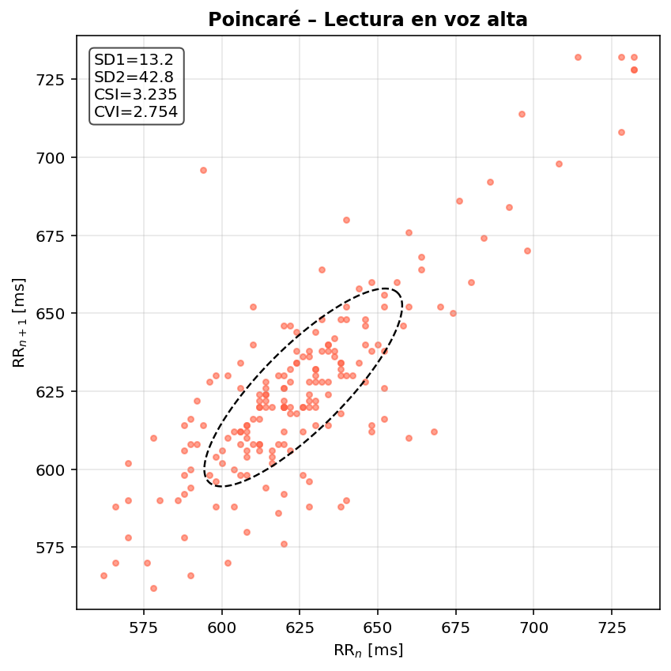

# Laboratorio 5  
## Variabilidad de la frecuencia cardíaca (HRV) y balance autonómico  

**Programa:** Ingeniería Biomédica  
**Asignatura:** Procesamiento Digital de Señales  
**Universidad:** Universidad Militar Nueva Granada  
**Estudiantes:** Danna Rivera, Duvan Paez

---



---
##  Introducción
 
El corazón no late a intervalos perfectamente regulares. Incluso en reposo, existe una variación natural en el tiempo entre latido y latido, conocida como variabilidad de la frecuencia cardíaca (HRV, por sus siglas en inglés). Esta variabilidad no es aleatoria: refleja el estado del sistema nervioso autónomo (SNA) y su influencia constante sobre el nodo sinusal del corazón.
 
El SNA opera a través de dos ramas con efectos opuestos sobre la frecuencia cardíaca. La rama simpática, asociada a situaciones de alerta, estrés o demanda cognitiva, acelera el corazón y reduce la variabilidad entre latidos. La rama parasimpática, predominante en el reposo, desacelera el corazón y permite una mayor variabilidad. El balance entre ambas ramas puede evaluarse de forma no invasiva a partir de la señal electrocardiográfica (ECG).
 
En este laboratorio se adquirió una señal ECG de 4 minutos dividida en dos condiciones: los primeros 2 minutos en reposo absoluto y los últimos 2 minutos durante la lectura en voz alta de un texto. La lectura en voz alta implica actividad cognitiva, motora y respiratoria, lo que se espera que produzca una activación simpática medible en la HRV.
 
El procesamiento de la señal incluyó filtrado IIR pasa banda, detección de picos R, cálculo de intervalos R-R y análisis tanto en el dominio del tiempo (media y SDNN) como mediante el diagrama de Poincaré (SD1, SD2, CSI, CVI). El objetivo es evidenciar, a través de estos parámetros, el cambio en el balance autonómico entre ambas condiciones.
 
---

## Parte A 
### a) Fundamento teórico

### Sistema nervioso autónomo
El sistema nervioso autónomo (SNA) regula funciones involuntarias del organismo a través de dos ramas:
 
- **Simpático:** activa al organismo ante situaciones de estrés o demanda cognitiva. Aumenta la frecuencia cardíaca y reduce la variabilidad (intervalos R-R más cortos y uniformes).
- **Parasimpático (vagal):** domina en estados de reposo. Disminuye la frecuencia cardíaca y aumenta la variabilidad (intervalos R-R más largos y variables).
### HRV – Variabilidad de la Frecuencia Cardíaca
La HRV mide las fluctuaciones en el tiempo entre latidos consecutivos (intervalos R-R), extraídos de la señal ECG. Es un indicador no invasivo del balance autonómico.
 
**Parámetros en el dominio del tiempo:**
- **Media R-R:** promedio de los intervalos entre picos R consecutivos (ms). Inversamente relacionado con la frecuencia cardíaca.
- **SDNN:** desviación estándar de los intervalos R-R. Refleja la variabilidad total de la señal.
### Diagrama de Poincaré
Representación gráfica donde cada intervalo R-R se grafica contra el siguiente (RRₙ vs RRₙ₊₁). La dispersión de la nube de puntos permite estimar el balance simpático/parasimpático mediante:
 - **SD1:**  Variabilidad a corto plazo → tono vagal
 - **SD2:**  Variabilidad a largo plazo → simpático + parasimpático
 - **CSI:**  Índice de actividad simpática
 - **CVI:**  Índice de actividad vagal
---
### b) Adquisición de la señal ECG


*Esquema colocación de electrodos*

- R: Debajo de la clavícula derecha.
- L: Debajo de la clavícula izquierda.
- F: Parte inferior del abdomen, borde inferior de la última costilla.
  
Se registró la señal electrocardiográfica de un sujeto durante 4 minutos:
- **0–2 min:** reposo absoluto (inmóvil y en silencio)
- **2–4 min:** lectura en voz alta de un texto
  
La frecuencia de muestreo utilizada fue de **500 Hz**, adecuada para capturar el complejo QRS del ECG. La adquisición se realizó con NI-DAQmx en modo finito, guardando la señal cruda y la filtrada en archivos `.txt`.
 
## Parte B 
### c) Pre-procesamiento de la señal
**Filtro:**
Se diseñó un filtro IIR Butterworth pasa banda de orden 4 con frecuencias de corte de 0.5 Hz y 40 Hz, utilizando una frecuencia de muestreo de 500 Hz,  implementado con condiciones iniciales en 0, para eliminar línea base y ruido muscular.

Los coeficientes obtenidos para el filtro fueron:

$$
b = [2.14\times10^{-3},\ 0,\ -8.56\times10^{-3},\ 0,\ 1.28\times10^{-2},\ 0,\ -8.56\times10^{-3},\ 0,\ 2.14\times10^{-3}]
$$

$$
a = [1,\ -6.70,\ 19.68,\ -33.15,\ 35.05,\ -23.83,\ 10.18,\ -2.50,\ 2.69\times10^{-1}]
$$

La implementación computacional del filtro mediante `lfilter` corresponde matemáticamente a la siguiente ecuación en diferencias:

$$
y[n] =
\sum_{k=0}^{M} b_k\,x[n-k]-\sum_{k=1}^{N} a_k\,y[n-k]
$$

donde:

- $x[n]$ corresponde a la señal ECG original,
- $y[n]$ corresponde a la señal filtrada,
- $b_k$ son los coeficientes del numerador,
- $a_k$ son los coeficientes del denominador.

En esta ecuación se reemplazan los coeficientes obtenidos del diseño Butterworth para implementar el filtro digital IIR aplicado a la señal ECG.

*Fragmento de código – filtro IIR:*
```python
# FILTRO IIR PASA BANDA ECG
fc_low  = 0.5
fc_high = 40
orden   = 4
 
b, a  = butter(orden, [fc_low/(fs/2), fc_high/(fs/2)], btype='bandpass')
ecg_f = lfilter(b, a, senal_total)
```
**Segmentación y detección de picos R:**
La señal filtrada se dividió en dos segmentos de 2 minutos. En cada segmento se detectaron los picos R con umbral del 60% del valor máximo y distancia mínima de 0.3 s entre picos, obteniendo así la serie R-R en milisegundos.
 
*Fragmento de código – segmentación y picos R:*
```python
n2m = int(2 * 60 * fs)
n15 = int(15 * fs)
 
seg1, t1 = ecg_f[:n2m],      t_total[:n2m]
seg2, t2 = ecg_f[n2m:2*n2m], t_total[n2m:2*n2m]
 
def picos_R(seg, fs):
    p, _ = find_peaks(seg, height=0.6*np.max(seg), distance=int(0.3*fs))
    return p
 
p1, p2 = picos_R(seg1, fs), picos_R(seg2, fs)
rr1    = np.diff(p1) / fs * 1000
rr2    = np.diff(p2) / fs * 1000
```

**ECG filtrada – Reposo (2 min completos):**


**ECG filtrada – Lectura en voz alta (2 min completos):**


**ECG filtrada – Reposo (muestra 15 s):**


**ECG filtrada – Lectura en voz alta (muestra 15 s):**


 ---
 ### d) Análisis de la HRV en el dominio del tiempo
 Con los intervalos R-R de cada segmento se calcularon y compararon los parámetros básicos de la HRV:
 
- **Media R-R:** valor promedio de los intervalos entre picos R consecutivos, expresado en milisegundos. Inversamente relacionado con la frecuencia cardíaca: una media R-R mayor indica un corazón más lento y mayor predominio parasimpático.
- **SDNN:** desviación estándar de los intervalos R-R. Refleja la variabilidad total de la señal. Un SDNN alto indica mayor variabilidad y mejor regulación autonómica; un SDNN bajo sugiere predominio simpático o menor flexibilidad del sistema.
La comparación entre ambos segmentos permite evidenciar si la tarea de lectura en voz alta produce un cambio relevante en el balance autonómico respecto al reposo.

*Fragmento de código – HRV dominio del tiempo:*
```python
print("\n===== HRV – DOMINIO DEL TIEMPO =====")
print(f"  Reposo  → Media R-R: {np.mean(rr1):.2f} ms | SDNN: {np.std(rr1, ddof=1):.2f} ms")
print(f"  Lectura → Media R-R: {np.mean(rr2):.2f} ms | SDNN: {np.std(rr2, ddof=1):.2f} ms")
```
 
**Resultados:**
 
| Parámetro | Reposo | Lectura |
|-----------|--------|---------|
| Media R-R (ms) | 660.02 | 625.99 |
| SDNN (ms) | 56.39 | 31.71 |
 
**Serie R-R comparada:**
 


Los resultados obtenidos muestran una disminución de la media R-R durante la lectura en voz alta, pasando de 660.02 ms a 625.99 ms, esto indica un incremento de la frecuencia cardíaca asociado a una mayor activación fisiológica durante la actividad cognitiva y motora.

Asimismo, el parámetro SDNN presentó una reducción considerable durante la lectura (56.39 ms → 31.71 ms), evidenciando una disminución de la variabilidad cardíaca total. Este comportamiento es consistente con un predominio simpático y una menor modulación parasimpática.

En la serie R-R comparada también puede observarse que durante el reposo los intervalos presentan una mayor dispersión y variabilidad, mientras que durante la lectura los intervalos se vuelven más uniformes y compactos, reflejando una regulación cardíaca más rígida.
 
---

## Parte C

### e) Diagrama de Poincaré

El diagrama de Poincaré es una herramienta de análisis no lineal, empleada en evaluar la dinámica de la variabilidad de la frecuencia cardíaca (HRV), con este método, cada intervalo R-R se grafica contra el intervalo siguiente, construyendo una nube de puntos cuya dispersión refleja el comportamiento autonómico del corazón. La forma y distribución de los puntos permiten estimar parámetros asociados a la actividad simpática y parasimpática. La obtención del diagrama se ralizó mediante:


```python
def plot_poincare(rr, sd1, sd2, csi, cvi, titulo, color):

    ang  = np.linspace(0, 2*np.pi, 200)
    e1   = np.array([ np.cos(np.pi/4), np.sin(np.pi/4)])
    e2   = np.array([-np.sin(np.pi/4), np.cos(np.pi/4)])
    elip = sd1 * np.outer(np.sin(ang), e2) + \
           sd2 * np.outer(np.cos(ang), e1)
    cx, cy = np.mean(rr[:-1]), np.mean(rr[1:])

    plt.figure(figsize=(6, 6))
    plt.scatter(rr[:-1], rr[1:], s=12,alpha=0.6, color=color)
    plt.plot(cx + elip[:,0],cy + elip[:,1],'k--', linewidth=1.2)
    plt.title(titulo)
    plt.xlabel("RRₙ [ms]")
    plt.ylabel("RRₙ₊₁ [ms]")
    plt.grid(True)
    plt.show()
```





- **SD1:** representa la variabilidad de corto plazo y se relaciona principalmente con la actividad parasimpática (vagal).
- **SD2:** representa la variabilidad de largo plazo y refleja la regulación autonómica global.
- **CSI (Cardiac Sympathetic Index):** indicador asociado a la actividad simpática.
- **CVI (Cardiac Vagal Index):** indicador asociado a la actividad vagal.

El cálculo de estos parámetros se realizó mediante:

```python
def poincare(rr):
    sd1 = np.std((rr[1:]-rr[:-1])/np.sqrt(2), ddof=1)
    sd2 = np.std((rr[1:]+rr[:-1])/np.sqrt(2), ddof=1)
    return sd1, sd2, sd2/sd1, np.log10(sd1*sd2)
```

Obteniendo los siguientes resultados: 

| Parámetro | Reposo | Lectura |
|-----------|--------|---------|
| SD1 | 46.17 | 13.24 |
| SD2 | 62.03 | 42.84 |
| CSI | 1.343 | 3.235 |
| CVI | 3.457 | 2.754 |

En el diagrama de Poincaré del estado de reposo se observa una nube de puntos más concentrada alrededor de la elipse principal, indicando un comportamiento cardíaco más estable y organizado. Durante la lectura en voz alta los puntos presentan una mayor dispersión y aparecen distribuidos en una zona más amplia del gráfico, reflejando cambios más variables entre intervalos R-R consecutivos debido a la actividad realizada.

Además, el parámetro SD1 disminuyó durante la lectura (46.17 a 13.24), indicando una reducción de la variabilidad de corto plazo, el índice CSI también aumentó (1.343 a 3.235), sugiriendo una mayor influencia simpática durante la lectura en voz alta. Aunque aparecen algunos puntos aislados en ambas gráficas, posiblemente asociados a ruido o detecciones atípicas, el comportamiento general coincide con el efecto esperado del sistema nervioso autónomo durante cada condición.

---

## Discusión

Los resultados obtenidos evidenciaron cambios en la variabilidad cardíaca entre el estado de reposo y la lectura en voz alta, durante la lectura se observó una disminución de la media R-R y del parámetro SDNN, indicando un aumento de la frecuencia cardíaca y una menor variabilidad. 

En el análisis de Poincaré también se observaron diferencias entre ambas condiciones. Durante la lectura los puntos mostraron una distribución más dispersa y el parámetro SD1 disminuyó considerablemente, mientras que el índice CSI aumentó, sugiriendo una mayor activación simpática. Aunque la señal presentó algunos puntos atípicos asociados posiblemente a ruido o movimiento, el comportamiento general coincide con la respuesta fisiológica esperada del sistema nervioso autónomo.

---

## Conclusiones

- Se logró adquirir y procesar correctamente una señal ECG mediante DAQ y Python.

- El filtro IIR Butterworth permitió reducir ruido y mejorar la detección de los picos R.

- Durante la lectura en voz alta se observó una disminución de la variabilidad cardíaca, evidenciada por la reducción de SDNN y SD1.

- Los diagramas de Poincaré permitieron visualizar diferencias entre el estado de reposo y la actividad de lectura.

- Los resultados obtenidos fueron coherentes con el comportamiento esperado del sistema nervioso autónomo.
