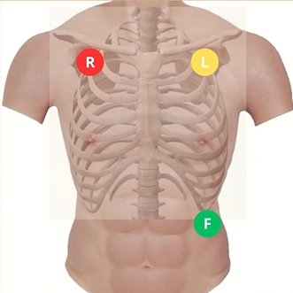
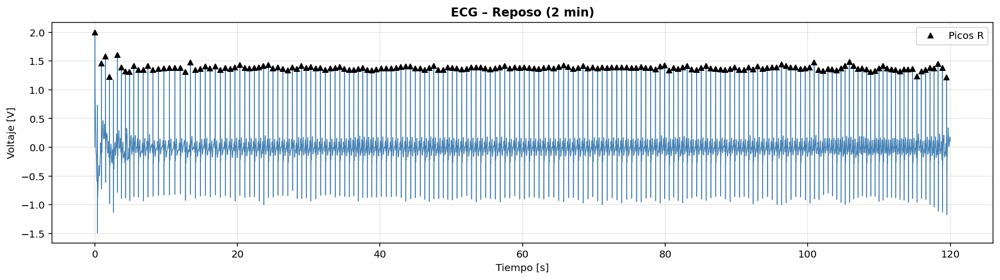
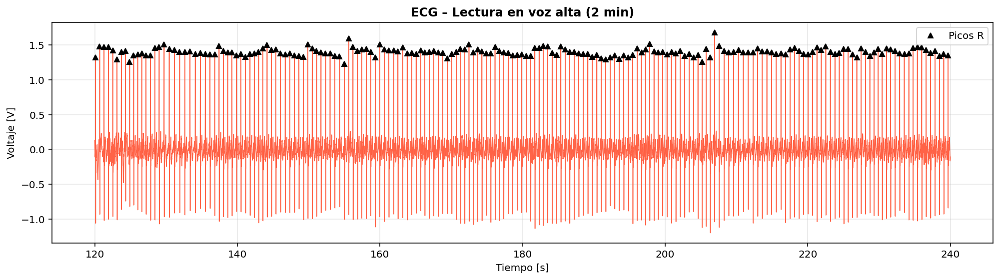
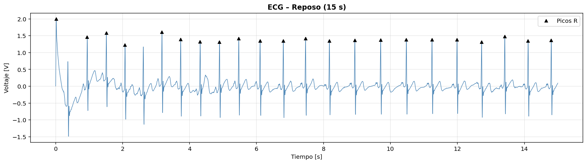
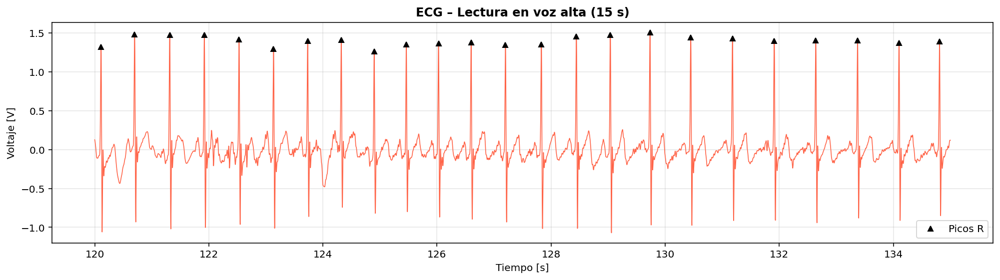
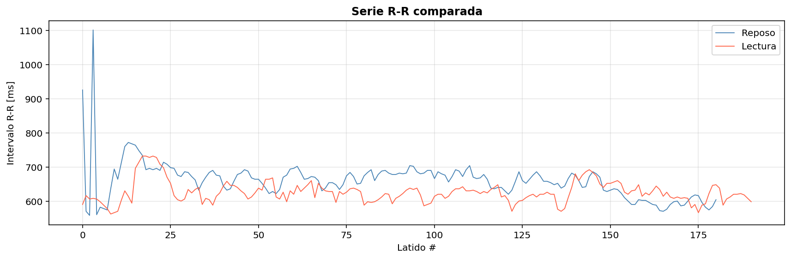

# Laboratorio 5  
## Variabilidad de la frecuencia cardíaca (HRV) y balance autonómico  

**Programa:** Ingeniería Biomédica  
**Asignatura:** Procesamiento Digital de Señales  
**Universidad:** Universidad Militar Nueva Granada  
**Estudiantes:** Danna Rivera, Duvan Paez

##  Introducción
 
El corazón no late a intervalos perfectamente regulares. Incluso en reposo, existe una variación natural en el tiempo entre latido y latido, conocida como variabilidad de la frecuencia cardíaca (HRV, por sus siglas en inglés). Esta variabilidad no es aleatoria: refleja el estado del sistema nervioso autónomo (SNA) y su influencia constante sobre el nodo sinusal del corazón.
 
El SNA opera a través de dos ramas con efectos opuestos sobre la frecuencia cardíaca. La rama simpática, asociada a situaciones de alerta, estrés o demanda cognitiva, acelera el corazón y reduce la variabilidad entre latidos. La rama parasimpática, predominante en el reposo, desacelera el corazón y permite una mayor variabilidad. El balance entre ambas ramas puede evaluarse de forma no invasiva a partir de la señal electrocardiográfica (ECG).
 
En este laboratorio se adquirió una señal ECG de 4 minutos dividida en dos condiciones: los primeros 2 minutos en reposo absoluto y los últimos 2 minutos durante la lectura en voz alta de un texto. La lectura en voz alta implica actividad cognitiva, motora y respiratoria, lo que se espera que produzca una activación simpática medible en la HRV.
 
El procesamiento de la señal incluyó filtrado IIR pasa banda, detección de picos R, cálculo de intervalos R-R y análisis tanto en el dominio del tiempo (media y SDNN) como mediante el diagrama de Poincaré (SD1, SD2, CSI, CVI). El objetivo es evidenciar, a través de estos parámetros, el cambio en el balance autonómico entre ambas condiciones.
 
---

## Parte A 
### a) Fundamento teórico

### Sistema nervioso autónomo
El sistema nervioso autónomo (SNA) regula funciones involuntarias del organismo a través de dos ramas:
 
- **Simpático:** activa al organismo ante situaciones de estrés o demanda cognitiva. Aumenta la frecuencia cardíaca y reduce la variabilidad (intervalos R-R más cortos y uniformes).
- **Parasimpático (vagal):** domina en estados de reposo. Disminuye la frecuencia cardíaca y aumenta la variabilidad (intervalos R-R más largos y variables).
### HRV – Variabilidad de la Frecuencia Cardíaca
La HRV mide las fluctuaciones en el tiempo entre latidos consecutivos (intervalos R-R), extraídos de la señal ECG. Es un indicador no invasivo del balance autonómico.
 
**Parámetros en el dominio del tiempo:**
- **Media R-R:** promedio de los intervalos entre picos R consecutivos (ms). Inversamente relacionado con la frecuencia cardíaca.
- **SDNN:** desviación estándar de los intervalos R-R. Refleja la variabilidad total de la señal.
### Diagrama de Poincaré
Representación gráfica donde cada intervalo R-R se grafica contra el siguiente (RRₙ vs RRₙ₊₁). La dispersión de la nube de puntos permite estimar el balance simpático/parasimpático mediante:
 - **SD1:**  Variabilidad a corto plazo → tono vagal
 - **SD2:**  Variabilidad a largo plazo → simpático + parasimpático
 - **CSI:**  Índice de actividad simpática
 - **CVI:**  Índice de actividad vagal
---
### b) Adquisición de la señal ECG

*Esquema colocación de electrodos*

Se registró la señal electrocardiográfica de un sujeto durante 4 minutos:
- **0–2 min:** reposo absoluto (inmóvil y en silencio)
- **2–4 min:** lectura en voz alta de un texto
  
La frecuencia de muestreo utilizada fue de **500 Hz**, adecuada para capturar el complejo QRS del ECG. La adquisición se realizó con NI-DAQmx en modo finito, guardando la señal cruda y la filtrada en archivos `.txt`.
 
## Parte B 
### c) Pre-procesamiento de la señal
**Filtro IIR Butterworth pasa banda:**
Se diseñó un filtro Butterworth pasa banda de orden 4 con frecuencias de corte 0.5 Hz y 40 Hz, implementado con condiciones iniciales en 0 (`lfilter`), para eliminar línea base y ruido muscular.
 
*Fragmento de código – filtro IIR:*
```python
# FILTRO IIR PASA BANDA ECG
fc_low  = 0.5
fc_high = 40
orden   = 4
 
b, a  = butter(orden, [fc_low/(fs/2), fc_high/(fs/2)], btype='bandpass')
ecg_f = lfilter(b, a, senal_total)
```
**Segmentación y detección de picos R:**
La señal filtrada se dividió en dos segmentos de 2 minutos. En cada segmento se detectaron los picos R con umbral del 60% del valor máximo y distancia mínima de 0.3 s entre picos, obteniendo así la serie R-R en milisegundos.
 
*Fragmento de código – segmentación y picos R:*
```python
n2m = int(2 * 60 * fs)
n15 = int(15 * fs)
 
seg1, t1 = ecg_f[:n2m],      t_total[:n2m]
seg2, t2 = ecg_f[n2m:2*n2m], t_total[n2m:2*n2m]
 
def picos_R(seg, fs):
    p, _ = find_peaks(seg, height=0.6*np.max(seg), distance=int(0.3*fs))
    return p
 
p1, p2 = picos_R(seg1, fs), picos_R(seg2, fs)
rr1    = np.diff(p1) / fs * 1000
rr2    = np.diff(p2) / fs * 1000
```

**ECG filtrada – Reposo (2 min completos):**


**ECG filtrada – Lectura en voz alta (2 min completos):**


**ECG filtrada – Reposo (muestra 15 s):**


**ECG filtrada – Lectura en voz alta (muestra 15 s):**


 ---
 ### d) Análisis de la HRV en el dominio del tiempo
 Con los intervalos R-R de cada segmento se calcularon y compararon los parámetros básicos de la HRV:
 
- **Media R-R:** valor promedio de los intervalos entre picos R consecutivos, expresado en milisegundos. Inversamente relacionado con la frecuencia cardíaca: una media R-R mayor indica un corazón más lento y mayor predominio parasimpático.
- **SDNN:** desviación estándar de los intervalos R-R. Refleja la variabilidad total de la señal. Un SDNN alto indica mayor variabilidad y mejor regulación autonómica; un SDNN bajo sugiere predominio simpático o menor flexibilidad del sistema.
La comparación entre ambos segmentos permite evidenciar si la tarea de lectura en voz alta produce un cambio relevante en el balance autonómico respecto al reposo.

*Fragmento de código – HRV dominio del tiempo:*
```python
print("\n===== HRV – DOMINIO DEL TIEMPO =====")
print(f"  Reposo  → Media R-R: {np.mean(rr1):.2f} ms | SDNN: {np.std(rr1, ddof=1):.2f} ms")
print(f"  Lectura → Media R-R: {np.mean(rr2):.2f} ms | SDNN: {np.std(rr2, ddof=1):.2f} ms")
```
 
**Resultados:**
 
| Parámetro | Reposo | Lectura |
|-----------|--------|---------|
| Media R-R (ms) | 660.02 | 625.99 |
| SDNN (ms) | 56.39 | 31.71 |
 
**Serie R-R comparada:**
 

 
---
